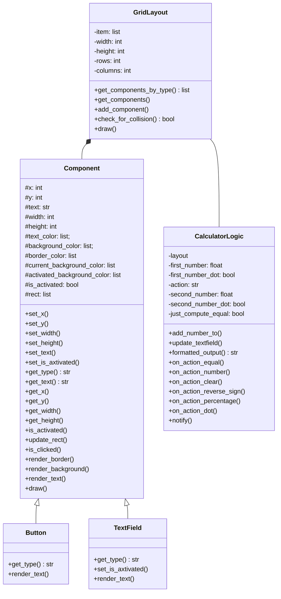

# UML diagram

```mermaid
classDiagram

      Component <|-- Button
      Component <|-- TextField
      GridLayout *-- Component
      GridLayout -- CalculatorLogic
      
      class Component{
        #x: int
        #y: int
        #text: str
        #width: int
        #height: int
        #text_color: list;
        #background_color: list;
        #border_color: list
        #current_background_color: list
        #activated_background_color: list
        #is_activated: bool
        #rect: list
        +set_x()
        +set_y()
        +set_width()
        +set_height()
        +set_text()
        +set_is_axtivated()
        +get_type() str
        +get_text() str
        +get_x()
        +get_y()
        +get_width()
        +get_height()
        +is_activated()
        +update_rect()
        +is_clicked()
        +render_border()
        +render_background()
        +render_text()
        +draw()        
      }
      
      class Button{
        +get_type() str
        +render_text() 
      }
      
      class TextField{
        +get_type() str
        +set_is_axtivated()
        +render_text() 
      }
      
      class GridLayout{
        -item: list
        -width: int
        -height: int
        -rows: int
        -columns: int
        +get_components_by_type() list
        +get_components()
        +add_component()
        +check_for_collision() bool
        +draw()
      }
      
      class CalculatorLogic{
        -layout
        -first_number: float
        -first_number_dot: bool
        -action: str
        -second_number: float
        -second_number_dot: bool
        -just_compute_equal: bool
        +add_number_to()
        +update_textfield()
        +formatted_output() str
        +on_action_equal()
        +on_action_number()
        +on_action_clear()
        +on_action_reverse_sign()
        +on_action_percentage()
        +on_action_dot()
        +notify()
      }
      
      
        

```